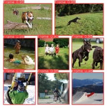
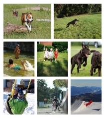

# <a name="_7yjucfwkzlrj"></a>**Frame Image Object Detection Tutorial using YoloV5**

This tutorial provides step-by-step instructions on how to build an ML model using YOLOv5 and train it to detect frame images in a picture. The training process will be conducted using Google Colab.

## <a name="_jnztrr1558jr"></a>***What is YOLOv5?***
*YOLOv5 is a model in the You Only Look Once (YOLO) family of computer vision models. YOLOv5 is commonly used for detecting objects. YOLOv5 comes in four main versions: small (s), medium (m), large (l), and extra large (x), each offering progressively higher accuracy rates. Each variant also takes a different amount of time to train(<https://blog.roboflow.com/yolov5-improvements-and-evaluation/>).*

**Introduction of the problem:**

We have an image (referred to as the parent image) that contains multiple frames, which are individual images. We need to extract these frames from the parent image without knowing the coordinates of these frames.

` `


We need to find the coordinates of the frames so that we can extract each frame individually.
## <a name="_hrc1k1flb6cr"></a>**Table of Contents**
- [Prerequisites](https://dillinger.io/#prerequisites)
- [Setup](https://dillinger.io/#setup)
- [Dataset Preparation](https://dillinger.io/#dataset-preparation)
- [Training](https://dillinger.io/#training)
- [Testing](https://dillinger.io/#testing)
- [Conclusion](https://dillinger.io/#conclusion)
## <a name="_itvtuswe53x7"></a>**Prerequisites**
- Basic knowledge of machine learning and computer vision concepts
- Python 3.x installed on your system.
- Basic knowledge of Python programming and deep learning concepts.
- Familiarity with YOLO object detection framework.
- Google Colab Account (For Training)
- Roboflow Account  (For Image Pre-Processing)
##
## <a name="_ffcvjpou1sb8"></a><a name="_k3k3xltxip22"></a>**Setup**
1. Open the Google Colab notebook by clicking on the following link: [Google Colab](https://colab.research.google.com/).
1. Make a copy of the notebook to your Google Drive for easy access and editing.
## <a name="_ydgapy4lw8e"></a>**Dataset Preparation**
1. **Collecting Image with Frames:**

To create data using online tools like Online Photo Collage Maker, you would need to visit their website and follow their instructions. Each tool may have its own interface and features, so it's best to explore the specific tool you choose.

Alternatively, if you prefer to create images using Python code, you can utilize various libraries such as PIL (Python Imaging Library) or OpenCV. Here's an example code snippet using the PIL library:

\```bash	

from PIL import Image

\# Create a blank canvas for the collage

canvas\_width = 800

canvas\_height = 600

canvas\_color = (255, 255, 255)  # White

canvas = Image.new('RGB', (canvas\_width, canvas\_height), canvas\_color)

\# Load and resize the images to be included in the collage

image1 = Image.open('image1.jpg')

image1 = image1.resize((200, 200))  # Adjust the size as needed

image2 = Image.open('image2.jpg')

image2 = image2.resize((200, 200))

\# Paste the resized images onto the canvas at desired positions

canvas.paste(image1, (50, 50))

canvas.paste(image2, (350, 50))

\# Save the collage as a new image file

canvas.save('collage.jpg')

\```

In the above code, you can specify the canvas size, background color, and the positions of the images on the canvas. Make sure to have the PIL library installed (pip install pillow) and provide the paths to the actual image files you want to include in the collage.

Feel free to modify the code according to your specific requirements, such as adding more images or adjusting their positions.


**2. Image Data Labeling and Annotation**

1. Install LabelImg: 

`	````bash 

pip install LabelImg

*```*

1. Launch LabelImg: 

\```bash Labelmg

1. Configure the annotation format: In the LabelImg toolbar, 
1. Begin labeling: Open an image from your dataset in LabelImg. Use the bounding box tool to draw boxes around the frame images you want to detect. Adjust the box position and size to accurately enclose each object. Assign the label class as "**Frame**" for each bounding box.
1. Save annotations: After annotating an image, click on "Save" to save the annotations in the YOLO format. This will generate a corresponding .txt file that contains the annotations for the image.
1. Continue labeling: Repeat the labeling process for all the images in your dataset.
1. Organize the dataset: Once you have labeled all the images, move the images into the images folder of your dataset, and place the corresponding annotation files (.xml) in the labels folder. Ensure that each image has its corresponding annotation file with the same filename.
1. Verify annotations: Double-check the annotations to ensure that the bounding boxes accurately enclose the frame images. Make any necessary adjustments or corrections.


**3. Image Data Pre-Processsing**

1. Sign up and create a project: Go to the Roboflow website (<https://roboflow.com/>) and sign up for an account. Once you're logged in, create a new project by clicking on the "New Project" button.


1. Upload your images: In your project, click on the "Upload" button to add your images.


1. Split dataset : Split your dataset into training and validation subsets. 


1. Image Transformation

In this step, we will process the training dataset of images. This will decrease training time and increase performance by applying image transformations to all the images in this dataset. Roboflow supports many methods for image transformation, such as resizing, auto orientation, and grayscale.

In this tutorial, we will apply the resize transformation with a target size of 640x640 pixels and the auto orientation transformation.


1. Image Augmentation

Augmentation performs transforms on your existing images to create new variations and increase the number of images in your dataset. This ultimately makes models more accurate across a broader range of use cases.


1. Generate Dataset: Clicking on Generate Button to generate image dataset


1. Download Dataset


##
## <a name="_n9xq8fvcy83w"></a><a name="_snepr2ybbjum"></a>**Training**

